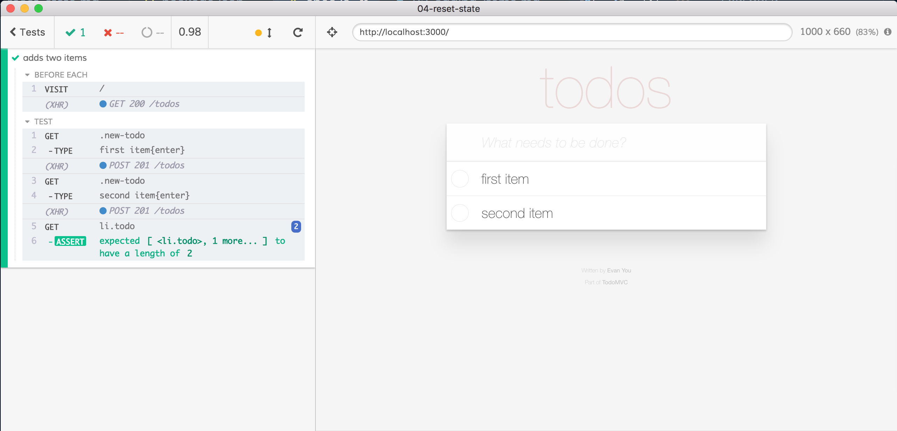
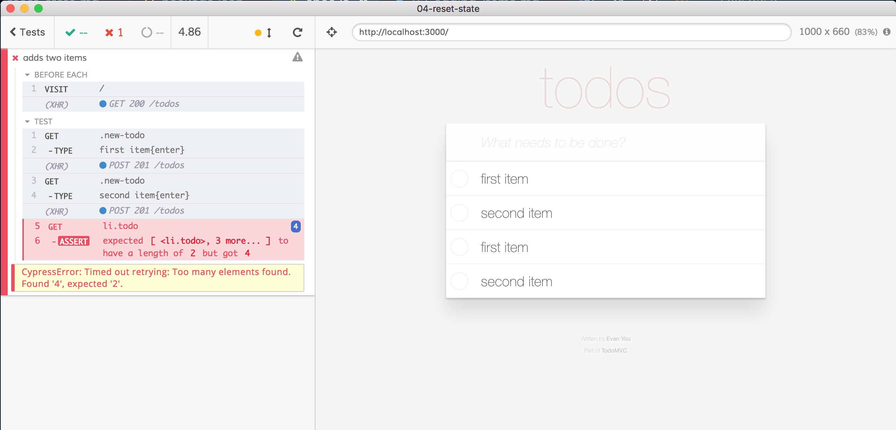
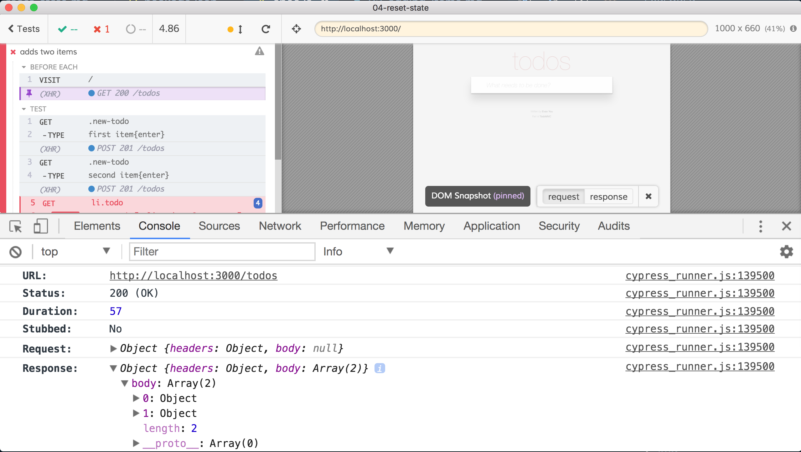
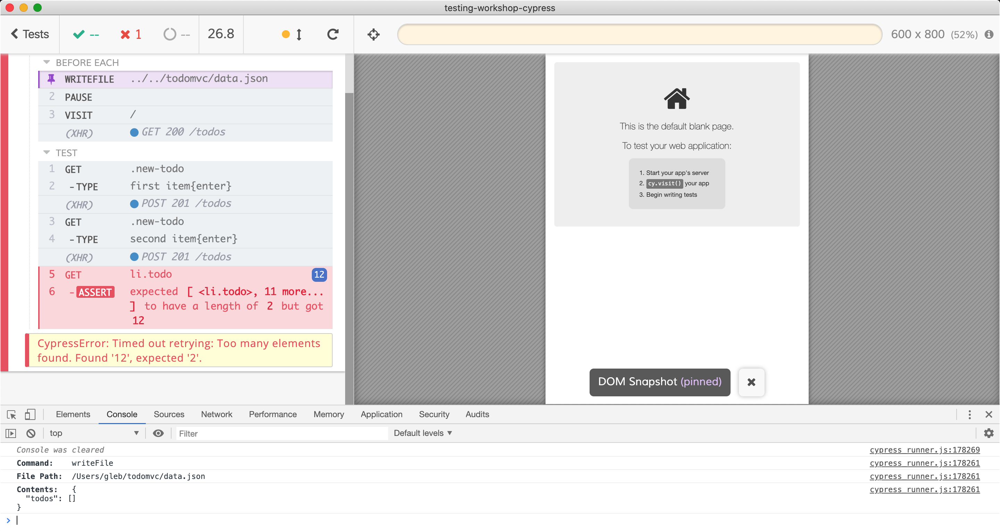

## ☀️ Part 4: Reset state data

### 📚 You will learn

- how one test can affect another test by leaving its data behind
- when and how to reset state during testing

---

## The problem

- keep `todomvc` app running
- open `cypress/integration/04-reset-state/spec.js`
- if you reload the test it starts failing 😕

+++



+++



+++



---

```javascript
// cypress/integration/04-reset-state/spec.js
beforeEach(() => {
  cy.visit('/')
})
const addItem = (text) => {
  cy.get('.new-todo').type(`${text}{enter}`)
}
it('adds two items', () => {
  addItem('first item')
  addItem('second item')
  cy.get('li.todo').should('have.length', 2)
})
```

+++

## Anti-pattern: using UI to clean up the state

- there could be 0, 1, or more items to remove
- the items could be paginated
- the spec becomes full of logic

See the example test in the spec file, it is complicated.

+++

## Questions

- how to reset the database?
  - **tip** we are using [json-server-reset](https://github.com/bahmutov/json-server-reset#readme) middleware
  - try to reset it from command line

```shell
# using https://httpie.io/ instead of curl
$ http POST :3000/reset todos:=[]
```

---

- how to make an arbitrary cross-domain XHR request from Cypress?
- reset the database before each test
  - modify `04-reset-state/spec.js` to make XHR call to reset the database
  - before or after `cy.visit`?

Note:
Students should modify `cypress/integration/04-reset-state/spec.js` and make the request to reset the database before each test using `cy.request`.

The answer to this and other TODO assignments are in [cypress/integration/04-reset-state/answer.js](/cypress/integration/04-reset-state/answer.js) file.

---

## Alternative: Using cy.writeFile

```
"start": "json-server --static . --watch data.json"
```

If we overwrite `todomvc/data.json` and reload the web app we should see new data

+++

## TODO: use cy.writeFile to reset todos

```js
describe('reset data using cy.writeFile', () => {
  beforeEach(() => {
    // TODO write file "todomvc/data.json" with stringified todos object
    cy.visit('/')
  })
  ...
})
```

See [`cy.writeFile`](https://on.cypress.io/writefile)

+++
Make sure you are writing the right file.



Note:
Most common mistake is using file path relative to the spec file, should be relative to the project's root folder.

---

## Alternative: use cy.task

You can execute Node code during browser tests by calling [`cy.task`](https://on.cypress.io/task)

```js
// cypress/plugins/index.js
module.exports = (on, config) => {
  on('task', {
    hello(name) {
      console.log('Hello', name)
      return null // or Promise
    }
  })
}
// cypress/integration/spec.js
cy.task('hello', 'World')
```

+++

## TODO reset data using cy.task

Find "resetData" task in cypress/plugins/index.js

```js
describe('reset data using a task', () => {
  beforeEach(() => {
    // call the task "resetData"
    // https://on.cypress.io/task
    // cy.task("resetData", ...)
    cy.visit('/')
  })
})
```

+++

## TODO set data using cy.task

Pass an object when calling `cy.task('resetData')`

```js
it('sets data to complex object right away', () => {
  cy.task('resetData' /* object*/)
  cy.visit('/')
  // check what is rendered
})
```

+++

## TODO set data from fixture

Pass an object when calling `cy.task('resetData')`

```js
it('sets data using fixture', () => {
  // load todos from "cypress/fixtures/two-items.json"
  // https://on.cypress.io/fixture
  // and then call the task to set todos
  // https://on.cypress.io/task
  cy.visit('/')
  // check what is rendered
})
```

---

## Reset data before each spec

Using the `experimentalInteractiveRunEvents` flag

```js
// cypress/plugins/index.js
module.exports = (on, config) => {
  on('before:spec', (spec) => {
    console.log('resetting DB before spec %s', spec.name)
    resetData()
  })
}
```

**Warning:** as of Cypress v7 only available in `cypress run` mode. See [https://on.cypress.io/before-spec-api](https://on.cypress.io/before-spec-api) for details.

---

## Best practices

- reset state before each test
  - in our [Best practices guide](https://on.cypress.io/best-practices)
- use [`cy.request`](https://on.cypress.io/request), [`cy.exec`](https://on.cypress.io/exec), [`cy.task`](https://on.cypress.io/task)
- watch presentation "Cypress: beyond the Hello World test" [https://slides.com/bahmutov/cypress-beyond-the-hello-world](https://slides.com/bahmutov/cypress-beyond-the-hello-world)

➡️ Pick the [next section](https://github.com/bahmutov/cypress-workshop-basics#contents)
