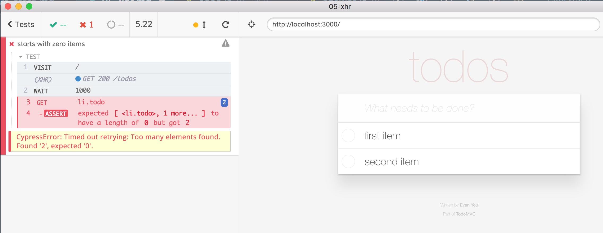
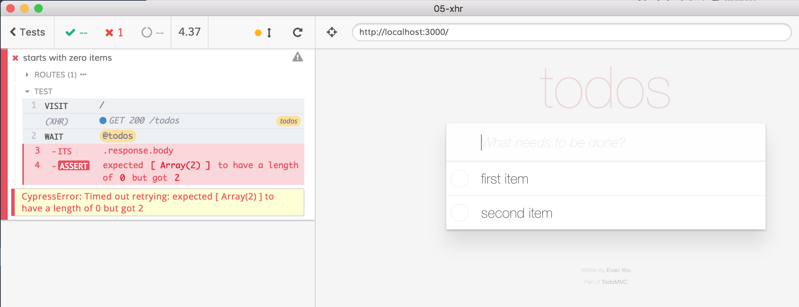
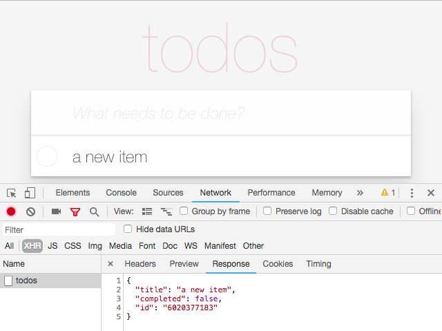

## ☀️ Part 5: Control network calls

### 📚 You will learn

- how to spy on / stub network calls
- how to wait for the network calls from tests
- how to use network calls in assertions

+++

- keep `todomvc` app running
- open `cypress/integration/05-xhr/spec.js`
- `cy.route` is deprecated, use `cy.intercept`

---

## Situation

- there is **no resetting** the state before each test
- the test passes but _something is wrong_

```javascript
it('starts with zero items', () => {
  cy.visit('/')
  cy.get('li.todo').should('have.length', 0)
})
```


+++

## Problem

- page loads
- web application makes XHR call "GET /todos"
  - meanwhile it shows an empty list of todos
- Cypress assertion passes! <!-- .element: class="fragment" -->
- "GET /todos" returns with 2 items <!-- .element: class="fragment" -->
  - they are added to the DOM
  - but the test has already finished

---

## Waiting

```javascript
// 05-xhr/spec.js
it('starts with zero items', () => {
  cy.visit('/')
  cy.wait(1000)
  cy.get('li.todo').should('have.length', 0)
})
```



+++

## Wait for application signal

```js
// todomvc/app.js
axios.get('/todos')
  ...
  .finally(() => {
    // an easy way for the application to signal
    // that it is done loading
    document.body.classList.add('loaded')
  })
```

**TODO:** write a test that waits for the body to have class "loaded" after the visit

+++

**better** to wait on a specific XHR request. Network is just observable public effect, just like DOM.

+++

### Todo

Use the test "starts with zero items" in the file `05-xhr/spec.js`

- spy on specific route with "cy.intercept" <!-- .element: class="fragment" -->
  - should we start mock server _before_ or _after_ `cy.visit`?
- save as an alias <!-- .element: class="fragment" -->
- wait for this XHR alias <!-- .element: class="fragment" -->
  - then check the DOM

**tips:** [`cy.intercept`]('https://on.cypress.io/intercept), [Network requests guide](https://on.cypress.io/network-requests)

+++

💡 No need to `cy.wait(...).then(...)`. All Cypress commands will be chained automatically.

```js
cy.intercept('GET', '/todos').as('todos')
cy.visit('/')
cy.wait('@todos')
// cy.get() will run AFTER cy.wait() finishes
cy.get('li.todo').should('have.length', 0)
```

Read [Introduction to Cypress](https://on.cypress.io/introduction-to-cypress) "Commands Run Serially"

---

## Todo

add to the test "starts with zero items":

- wait for the XHR alias like before
- its response body should be an empty array



---

## Stub the network call

Update test "starts with zero items (stubbed response)"

- instead of just spying on XHR call, let's return some mock data

```javascript
// returns an empty list
// when `GET /todos` is requested
cy.intercept('GET', '/todos', [])
```

+++

```javascript
it('starts with zero items (fixture)', () => {
  // stub `GET /todos` with fixture "empty-list"

  // visit the page
  cy.visit('/')

  // then check the DOM
  cy.get('li.todo').should('have.length', 0)
})
```
**tip:** use [`cy.fixture`](https://on.cypress.io/fixture) command

+++

```javascript
it('loads several items from a fixture', () => {
  // stub route `GET /todos` with data from a fixture file "two-items.json"
  // THEN visit the page
  cy.visit('/')
  // then check the DOM: some items should be marked completed
  // we can do this in a variety of ways
})
```

---

### Spying on adding an item network call

When you add an item through the DOM, the app makes `POST` XHR call.


Note:
It is important to be able to use DevTools network tab to inspect the XHR and its request and response.

+++

**Todo 1/2**

- write a test "posts new item to the server" that confirms that new item is posted to the server


Note:
see instructions in the `05-xhr/spec.js` for the test

+++

**Todo 2/2**

- write a test "posts new item to the server response" that confirms that RESPONSE when a new item is posted to the server



Note:
see instructions in the `05-xhr/spec.js` for the test

---

## Bonus

Network requests guide at [https://on.cypress.io/network-requests](https://on.cypress.io/network-requests). Question: which requests do you spy on, which do you stub?

---

## Testing the loading element

In the application we are showing (very quickly) "Loading" state

```html
<div class="loading" v-show="loading">Loading data ...</div>
```

+++

## Todo

- delay the loading XHR request
- assert the UI is showing "Loading" element
- assert the "Loading" element goes away after XHR completes

⌨️ test "shows loading element"

---
## Let's test an edge data case

User cannot enter blank titles. What if our database has old data records with blank titles which it returns on load? Does the application show them? Does it crash?

**Todo** write the test `handles todos with blank title`

---
## 🏁 Spy and stub the network from your tests

- confirm the REST calls
- stub random data

➡️ Pick the [next section](https://github.com/bahmutov/cypress-workshop-basics#contents)
