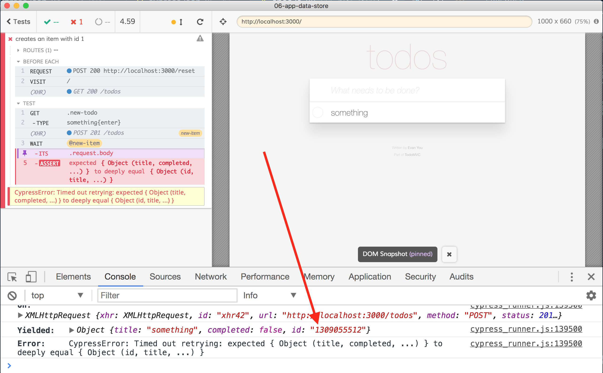

## ☀️ Part 6: Application data store

### 📚 You will learn

- how to access the running application from test code
- how to spy on or stub an application method
- how to drive application by dispatching actions

+++

- keep `todomvc` app running
- open `cypress/integration/06-app-data-store/spec.js`
- test that Vuex data store is working correctly

---

## Spy on console.log

```js
it('logs a todo add message to the console', () => {
  // get the window object from the app's iframe
  // using https://on.cypress.io/window
  // get its console object and spy on the "log" method
  // using https://on.cypress.io/spy
  // add a new todo item
  // get the spy and check that it was called
  // with the expected arguments
})
```

Read [https://on.cypress.io/stubs-spies-and-clocks](https://on.cypress.io/stubs-spies-and-clocks) and [https://glebbahmutov.com/cypress-examples/commands/spies-stubs-clocks.html](https://glebbahmutov.com/cypress-examples/commands/spies-stubs-clocks.html)

---

## The application object

```javascript
// todomvc/app.js
// if you want to expose "app" globally only
// during end-to-end tests you can guard it using "window.Cypress" flag
// if (window.Cypress) {
window.app = app
// }
```

+++


+++

## Todo: confirm window.app

```js
// cypress/integration/06-app-data-store/spec.js
it('has window.app property', () => {
  // get its "app" property
  // and confirm it is an object
  // see https://on.cypress.io/its
  cy.window()
})
```

---

## Todo: confirm window.app.$store

```js
// cypress/integration/06-app-data-store/spec.js
it('has window.app property', () => {
  // get the app.$store property
  // and confirm it has expected Vuex properties
  // see https://on.cypress.io/its
  cy.window()
})
```

---

## Todo: the initial Vuex state

```js
it('starts with an empty store', () => {
  // the list of todos in the Vuex store should be empty
  cy.window()
})
```

---

## Todo: check Vuex state

Let's add two items via the page, then confirm the Vuex store has them

```javascript
// cypress/integration/06-app-data-store/spec.js
const addItem = (text) => {
  cy.get('.new-todo').type(`${text}{enter}`)
}
it('adds items to store', () => {
  addItem('something')
  addItem('something else')
  // get application's window
  // then get app, $store, state, todos
  // it should have 2 items
})
```

---

## Question

Why can't we confirm both items using `should('deep.equal', [...])`?

```js
cy.window()
  .its('app.$store.state.todos')
  .should('deep.equal', [
    { title: 'something', completed: false, id: '1' },
    { title: 'else', completed: false, id: '2' }
  ])
```

+++



---

## Non-determinism

- random data in tests makes it very hard
- UUIDs, dates, etc
- Cypress includes network and method stubbing using [http://sinonjs.org/](http://sinonjs.org/)
- [https://on.cypress.io/network-requests](https://on.cypress.io/network-requests)
- [https://on.cypress.io/stubs-spies-and-clocks](https://on.cypress.io/stubs-spies-and-clocks)

+++

## Questions

- how does a new item get its id?
- can you override random id generator from DevTools? <!-- .element: class="fragment" -->

---

## Stub application's random generator

- test "creates an item with id 1" in `06-app-data-store/spec.js`
- get the application's context using `cy.window`
- get application's `window.Math` object
- can you stub application's random generator?
  - **hint** use `cy.stub`

+++

## Confirm spy's behavior

- test "creates an item with id using a stub"
- write a test that adds 1 item
- name spy with an alias `cy.spy(...).as('name')`
- get the spy using the alias and confirm it was called once

---

## Abstract common actions

The tests can repeat common actions (like creating items) by always going through the DOM, called **page objects**

The tests can access the app and call method bypassing the DOM, called "app actions" <!-- .element: class="fragment" -->

The tests can be a combination of DOM and App actions. <!-- .element: class="fragment" -->

Read [https://glebbahmutov.com/blog/realworld-app-action/](https://glebbahmutov.com/blog/realworld-app-action/)

+++

## Practice

Write a test that:

- dispatches actions to the store to add items
- confirms new items are added to the DOM

(see next slide)
+++

```js
it('adds todos via app', () => {
  // bypass the UI and call app's actions directly from the test
  // using https://on.cypress.io/invoke
  // app.$store.dispatch('setNewTodo', <desired text>)
  // app.$store.dispatch('addTodo')
  // and then check the UI
})
```

+++

## Todo: test edge data case

```js
it('handles todos with blank title', () => {
  // add todo that the user cannot add via UI
  cy.window().its('app.$store').invoke('dispatch', 'setNewTodo', '  ')
  // app.$store.dispatch('addTodo')
  // confirm the UI
})
```

+++

### ⚠️ Watch out for stale data

Note that the web application might NOT have updated the data right away. For example:

```js
getStore().then((store) => {
  store.dispatch('setNewTodo', 'a new todo')
  store.dispatch('addTodo')
  store.dispatch('clearNewTodo')
})
// not necessarily has the new item right away
getStore().its('state')
```

Note:
In a flaky test https://github.com/cypress-io/cypress-example-recipes/issues/246 the above code was calling `getStore().its('state').snapshot()` sometimes before and sometimes after updating the list of todos.

+++

### ⚠️ Watch out for stale data

**Solution:** confirm the data is ready before using it.

```js
// add new todo using dispatch
// retry until new item is in the list
getStore().its('state.todos').should('have.length', 1)
// do other checks
```

---

## 🏁 App Access

- when needed, you can access the application directly from the test

Read also:

- https://www.cypress.io/blog/2018/11/14/testing-redux-store/,
- https://glebbahmutov.com/blog/stub-navigator-api/
- https://glebbahmutov.com/blog/realworld-app-action/

➡️ Pick the [next section](https://github.com/bahmutov/cypress-workshop-basics#contents)
