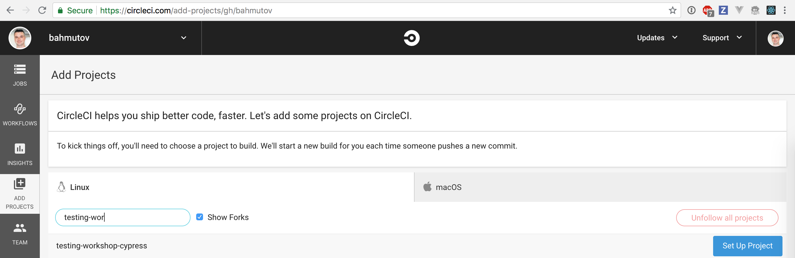

## ☀️ Part 7: Continuous integration

### 📚 You will learn

- Cypress Docker images for dependencies
- Installing and caching Cypress itself
- How to start server and run Cypress tests
- CircleCI Orb example
- GitHub Actions example

---

## Todo if possible

- sign up for free account on CircleCI
- use the specs from folder `cypress/ci-tests`
  - UI spec
  - Data store spec
  - API calls spec

---

## Open vs Run

- run the specs in the interactive mode with `cypress open`
- run the specs in the headless mode with `cypress run`

See [https://on.cypress.io/command-line](https://on.cypress.io/command-line)

+++

## Config files

- by default, all Cypress settings are in `cypress.json`
- for CI this repo has `cypress-ci.json`

It overrides the integration folder

```text
"integrationFolder": "cypress/ci-tests"
```

Todo: run Cypres with

```shell
$ npx cypress run --config-file cypress-ci.json
```

---

## Set up CircleCI

- sign up for CircleCI
- fork this repo [bahmutov/cypress-workshop-basics](https://github.com/bahmutov/cypress-workshop-basics)
- add project to CircleCI



+++

## Continuous integration documentation

- [https://on.cypress.io/continuous-integration](https://on.cypress.io/continuous-integration)
- [https://on.cypress.io/ci](https://on.cypress.io/ci) (alias)

+++

## Todo

Read file `.circleci/circle.yml`

- uses CircleCI V2 [https://circleci.com/docs/2.0/sample-config/](https://circleci.com/docs/2.0/sample-config/)
- Docker file from [https://github.com/cypress-io/cypress-docker-images](https://github.com/cypress-io/cypress-docker-images)

---

## On CI:

- install and cache dependencies
- start `todomvc` server in the background
- run Cypress using the config file `cypress-ci.json`

+++

```yaml
version: 2
jobs:
  build:
    docker:
      - image: cypress/base:12
    working_directory: ~/repo
    steps:
      - checkout
      - restore_cache:
          keys:
          - dependencies-{{ checksum "package.json" }}
          # fallback to using the latest cache if no exact match is found
          - dependencies-
      - run:
          name: Install dependencies
          # https://docs.npmjs.com/cli/ci
          command: npm ci
      - save_cache:
          paths:
            - ~/.npm
            - ~/.cache
          key: dependencies-{{ checksum "package.json" }}
      # continued: start the app and run the tests
```

+++

```yaml
# two commands: start server, run tests
- run:
    name: Start TodoMVC server
    command: npm start
    working_directory: todomvc
    background: true
- run:
    name: Run Cypress tests
    command: npx cypress run --config-file cypress-ci.json
```

+++

Alternative: use [start-server-and-test](https://github.com/bahmutov/start-server-and-test)

```yaml
- run:
  name: Start and test
  command: npm run ci
```

```json
{
  "scripts": {
    "start": "npm start --prefix todomvc -- --quiet",
    "test": "cypress run --config-file cypress-ci.json",
    "ci": "start-test 3000"
  }
}
```

---

## CircleCI Cypress Orb

A *much simpler* CI configuration.

```yaml
version: 2.1
orbs:
  # import Cypress orb by specifying an exact version x.y.z
  # or the latest version 1.x.x using "@1" syntax
  # https://github.com/cypress-io/circleci-orb
  cypress: cypress-io/cypress@1
workflows:
  build:
    jobs:
      # "cypress" is the name of the imported orb
      # "run" is the name of the job defined in Cypress orb
      - cypress/run
```

See [https://github.com/cypress-io/circleci-orb](https://github.com/cypress-io/circleci-orb)

+++

## Todo

Look how tests are run in [.circleci/config.yml](https://github.com/bahmutov/cypress-workshop-basics/blob/main/.circleci/config.yml) using [cypress-io/circleci-orb](https://github.com/cypress-io/circleci-orb).

---

## Store test artifacts

```yaml
version: 2.1
orbs:
  # https://github.com/cypress-io/circleci-orb
  cypress: cypress-io/cypress@1
workflows:
  build:
    jobs:
      - cypress/run:
          # store videos and any screenshots after tests
          store_artifacts: true
```

+++

## Record results on Dashboard

```yaml
version: 2.1
orbs:
  # https://github.com/cypress-io/circleci-orb
  cypress: cypress-io/cypress@1
workflows:
  build:
    jobs:
      # set CYPRESS_RECORD_KEY as CircleCI
      # environment variable
      - cypress/run:
          record: true
```

[https://on.cypress.io/dashboard-introduction](https://on.cypress.io/dashboard-introduction)

+++

## Parallel builds

```yaml
version: 2.1
orbs:
  # https://github.com/cypress-io/circleci-orb
  cypress: cypress-io/cypress@1
workflows:
  build:
    jobs:
      - cypress/install # single install job
      - cypress/run: # 4 test jobs
          requires:
            - cypress/install
          record: true # record results on Cypress Dashboard
          parallel: true # split all specs across machines
          parallelism: 4 # use 4 CircleCI machines
```

+++

## CircleCI Cypress Orb

Never struggle with CI config 👍

- [github.com/cypress-io/circleci-orb](https://github.com/cypress-io/circleci-orb)
- [circleci.com/orbs/registry/orb/cypress-io/cypress](https://circleci.com/orbs/registry/orb/cypress-io/cypress)
- 📺 [CircleCI + Cypress webinar](https://youtu.be/J-xbNtKgXfY)

---

## GitHub Actions

- cross-platform CI built on top of Azure CI + MacStadium
- Linux, Windows, and Mac
- Official [cypress-io/github-action](https://github.com/cypress-io/github-action)

+++

```yaml
jobs:
  cypress-run:
    runs-on: ubuntu-20.04
    steps:
      - uses: actions/checkout@v2
      # https://github.com/cypress-io/github-action
      - uses: cypress-io/github-action@v2
        with:
          start: npm start
          wait-on: 'http://localhost:3000'
          config-file: 'cypress-ci.json'
```

Check [.github/workflows/ci.yml](https://github.com/bahmutov/cypress-workshop-basics/blob/main/.github/workflows/ci.yml)

---

## Cypress on CI: take away

- use `npm ci` command instead of `npm install`
- cache `~/.npm` and `~/.cache` folders
- use [start-server-and-test](https://github.com/bahmutov/start-server-and-test) for simplicity
- store videos and screenshots yourself or use Cypress Dashboard

+++

## Todo

Find the CI you use on [https://on.cypress.io/continuous-integration](https://on.cypress.io/continuous-integration) and [https://github.com/cypress-io/cypress-example-kitchensink#ci-status](https://github.com/cypress-io/cypress-example-kitchensink#ci-status)

➡️ Pick the [next section](https://github.com/bahmutov/cypress-workshop-basics#contents)
