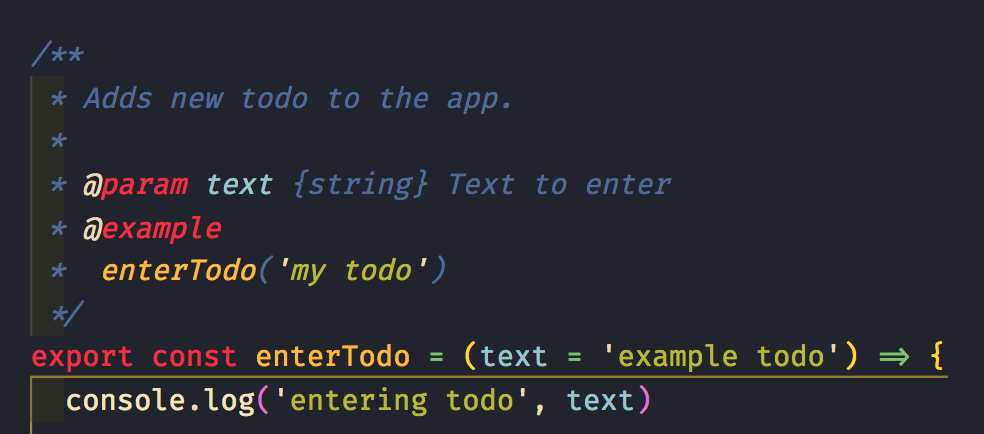
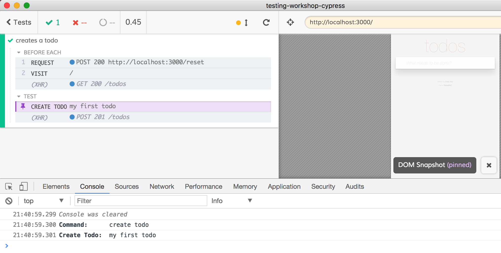
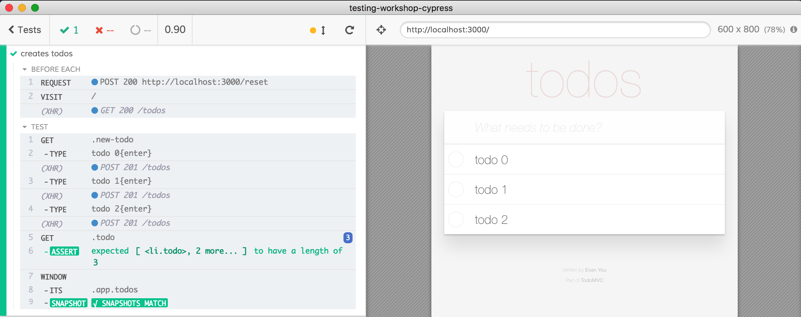

## ☀️ Part 12: Custom commands

### 📚 You will learn

- adding new commands to `cy`
- supporting retry-ability
- TypeScript definition for new command
- useful 3rd party commands

+++

- keep `todomvc` app running
- open `cypress/integration/12-custom-commands/spec.js`

+++

### 💯 Code reuse and clarity

```js
beforeEach(function resetData () {
  cy.request('POST', '/reset', {
    todos: []
  })
})
beforeEach(function visitSite () {
  cy.visit('/')
})
```

Note:
Before each test we need to reset the server data and visit the page. The data clean up and opening the site could be a lot more complex that our simple example. We probably want to factor out `resetData` and `visitSite` into reusable functions every spec and test can use.

+++

### Todo: move them into `cypress/support/index.js`

Now these `beforeEach` hooks will be loaded _before every_ test in every spec.

Note:
Is this a good solution?

+++

### Todo: move them into `cypress/support/hooks.js`

And load from the spec file:

```js
// automatically runs "beforeEach" hooks
import '../../support/hooks'

it('enters 10 todos', function () {
  ...
})
```

Note:
A better solution, because only the spec file that needs these hooks can load them.

+++

### Todo: export the `resetData` and `visitSite`

```js
// cypress/support/hooks.js
export function resetData () { ... }
export function visitSite () { ... }
```

⌨️ and update `spec.js`

+++

## My opinion

> Little reusable functions are the best

```js
import {
  enterTodo, getTodoApp, getTodoItems, resetDatabase, visit
} from '../../support/utils'
it('loads the app', () => {
  resetDatabase()
  visit()
  getTodoApp().should('be.visible')
  enterTodo('first item')
  enterTodo('second item')
  getTodoItems().should('have.length', 2)
})
```

Note:
Some functions can return `cy` instance, some don't, whatever is convenient. I also find small functions that return complex selectors very useful to keep selectors from duplication.

+++

Pro: functions are easy to document with JSDoc



+++

And then IntelliSense works immediately


+++

And MS IntelliSense can understand types from JSDoc and check those!

[https://github.com/Microsoft/TypeScript/wiki/JSDoc-support-in-JavaScript](https://github.com/Microsoft/TypeScript/wiki/JSDoc-support-in-JavaScript)

More details in: [https://slides.com/bahmutov/ts-without-ts](https://slides.com/bahmutov/ts-without-ts)

+++

## Use cases for custom commands

- share code in entire project without individual imports
- complex logic with custom logging into Command Log
  * login sequence
  * many application actions

📝 [on.cypress.io/custom-commands](https://on.cypress.io/custom-commands)

+++

Let's write a custom command to create a todo

```js
// instead of this
cy.get('.new-todo')
  .type('todo 0{enter}')
// use this
cy.createTodo('todo 0')
```

+++

## Todo: write and use "createTodo"

```js
Cypress.Commands.add('createTodo', todo => {
  cy.get('.new-todo').type(`${todo}{enter}`)
})
it('creates a todo', () => {
  cy.createTodo('my first todo')
})
```

+++

## ⬆️ Make it better

- have IntelliSense working for `createTodo`
- have nicer Command Log

+++

## Todo: add `createTodo` to `cy` object

How: [https://github.com/cypress-io/cypress-example-todomvc#cypress-intellisense](https://github.com/cypress-io/cypress-example-todomvc#cypress-intellisense)

+++

⌨️ in file `cypress/integration/12-custom-commands/custom-commands.d.ts`

```ts
/// <reference types="cypress" />
declare namespace Cypress {
  interface Chainable<Subject> {
    /**
     * Creates one Todo using UI
     * @example
     * cy.createTodo('new item')
     */
    createTodo(todo: string): Chainable<any>
  }
}
```

+++

Load the new definition file in `cypress/integration/12-custom-commands/spec.js`

```js
/// <reference path="./custom-commands.d.ts" />
```

+++


More JSDoc examples: [https://slides.com/bahmutov/ts-without-ts](https://slides.com/bahmutov/ts-without-ts)

Note:
Editors other than VSCode might require work.

+++

⚠️ tell Cypress to ignore ".d.ts" files using `ignoreTestFiles` in cypress.json or save ".d.ts" files outside the integration folder.

Note:
Otherwise Cypress will try load ".d.ts" file as spec and without TypeScript loader will fail.

+++

## Better Command Log

```js
Cypress.Commands.add('createTodo', todo => {
  cy.get('.new-todo', { log: false })
    .type(`${todo}{enter}`, { log: false })
  cy.log('createTodo', todo)
})
```

+++

## Even better Command Log

```js
Cypress.Commands.add('createTodo', todo => {
  const cmd = Cypress.log({
    name: 'create todo',
    message: todo,
    consoleProps () {
      return {
        'Create Todo': todo
      }
    }
  })
  cy.get('.new-todo', { log: false })
    .type(`${todo}{enter}`, { log: false })
})
```

+++



+++

### Mark command completed

```js
cy.get('.new-todo', { log: false })
  .type(`${todo}{enter}`, { log: false })
  .then($el => {
    cmd
      .set({ $el })
      .snapshot()
      .end()
  })
```

**Pro-tip:** you can have multiple command snapshots.

+++

### Show result in the console

```js
// result will get value when command ends
let result
const cmd = Cypress.log({
  consoleProps () {
    return { result }
  }
})
// custom logic then:
.then(value => {
  result = value
  cmd.end()
})
```

+++

## 3rd party custom commands

- [cypress-xpath](https://github.com/cypress-io/cypress-xpath)
- [cypress-plugin-snapshots](https://github.com/meinaart/cypress-plugin-snapshots)
- [cypress-pipe](https://github.com/NicholasBoll/cypress-pipe)

[on.cypress.io/plugins#custom-commands](https://on.cypress.io/plugins#custom-commands)

+++

## Try `cypress-xpath`

```sh
# already done in this repo
npm install -D cypress-xpath
```

in `cypress/support/index.js`

```js
require('cypress-xpath')
```

+++

With `cypress-xpath`

```js
it('finds list items', () => {
  cy.xpath('//ul[@class="todo-list"]//li')
    .should('have.length', 3)
})
```

+++

## Custom command with retries

How does `xpath` command retry the assertions that follow it?

```js
cy.xpath('...') // command
  .should('have.length', 3) // assertions
```

+++

```js
// use cy.verifyUpcomingAssertions
const resolveValue = () => {
  return Cypress.Promise.try(getValue).then(value => {
    return cy.verifyUpcomingAssertions(value, options, {
      onRetry: resolveValue,
    })
  })
}
```

+++

## Try `cypress-pipe`

Easily retry your own functions

```sh
npm home cypress-pipe
```

Advanced example: [https://www.cypress.io/blog/2019/01/22/when-can-the-test-click/](https://www.cypress.io/blog/2019/01/22/when-can-the-test-click/)

+++

### Todo: retry getting object's property

```js
const o = {}
setTimeout(() => {
  o.foo = 'bar'
}, 1000)
```

- until it becomes defined
- and is equal to

⌨️ test "passes when object gets new property"

+++

### Try `cypress-plugin-snapshots`

⚠️ install requires 3 parts: command, plugin, env config object

```js
it('creates todos', () => {
  // add a few todos
  cy.window()
    .its('app.todos')
    .toMatchSnapshot()
})
```

+++



+++

## Todo: use data snapshot

- ignore "id" field, because it is dynamic
- update snapshot if you add todo

+++

## Advanced concepts

- parent vs child command
- overwriting `cy` command

[on.cypress.io/custom-commands](https://on.cypress.io/custom-commands), [https://www.cypress.io/blog/2018/12/20/element-coverage/](https://www.cypress.io/blog/2018/12/20/element-coverage/)

+++
## Example: overwrite `cy.type`

```js
Cypress.Commands.overwrite('type',
  (type, $el, text, options) => {

  // just adds element selector to the
  // list of seen elements
  rememberSelector($el)

  return type($el, text, options)
})
```

[https://www.cypress.io/blog/2018/12/20/element-coverage/](https://www.cypress.io/blog/2018/12/20/element-coverage/)

+++


Video of element coverage, [https://slides.com/bahmutov/test-coverage-update](https://slides.com/bahmutov/test-coverage-update)

+++

## Best practices

- Making reusable function is often faster than writing a custom command
- Know Cypress API to avoid writing what's already available <!-- .element: class="fragment" -->

➡️ Pick the [next section](https://github.com/bahmutov/cypress-workshop-basics#contents)
