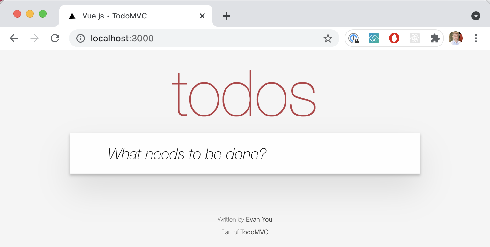
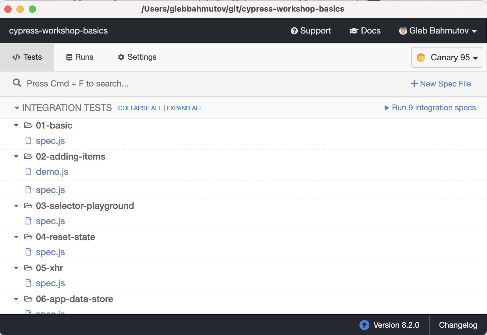

# cypress-workshop-basics

[![ci status][ci image]][ci url] [![badges status][badges image]][badges url] [![slides status][slides image]][slides url] [](https://circleci.com/gh/bahmutov/cypress-workshop-basics/tree/main)

[](https://dashboard.cypress.io/projects/89mmxs/runs) [![renovate-app badge][renovate-badge]][renovate-app] 

> Basics of end-to-end testing with [Cypress.io](https://www.cypress.io) test runner

## Introduction

Web sites that do not work are bad. Full end-to-end automated tests are the best way to gain the confidence that the entire system will work when the real user visits the site. This workshop introduces you to the Cypress.io Test Runner and teaches writing realistic tests that are readable, reliable, and fast.

### Topics

This workshop covers the topics relevant to both beginners and experienced Cypress users. Over the half or full-day workshop we will cover the following topics through the hands-on exercises:

- Installing Cypress and writing the first test
- Cypress documentation, examples, and recipes
- Selecting the DOM elements and interacting with the page
- Controlling the application state
- Removing test flake
- Spying and stubbing the network communication from tests
- Running Cypress tests on Continuous Integration system
- Factoring out pieces of tests into custom commands

### Target audience

This workshop will be very useful for every web developer and every tester looking to automate web application testing. Only a minimal knowledge of JavaScript is required, although previous experience with web programming and browser DevTools is very helpful.

## Requirements

- Any computer: Mac, Windows, Linux
- [Node 14+ (LTS)](https://nodejs.org/), see my [Node install video](https://youtu.be/09KbTRLrgWA), and my [Node versions using NVM video](https://youtu.be/CNnCz6StbbY)
- [git](https://git-scm.com)

Check the Node version

```
$ node -v
# for example v14.17.1
$ npm -v
# for example 6.14.13
```

In order to get the code and install NPM dependencies

```bash
git clone git@github.com:bahmutov/cypress-workshop-basics.git
cd cypress-workshop-basics
npm install
```

If necessary, install dependencies inside TodoMVC folder

```bash
cd todomvc
npm install
```

### Quick check ✅

You can test the installation by starting TodoMVC in the first terminal window

```shell
npm start
```

and you should see in the terminal

```text
> json-server --static . data.json --middlewares ./node_modules/json-server-reset


  \{^_^}/ hi!

  Loading data.json
  Loading ./node_modules/json-server-reset
  Done

  Resources
  http://localhost:3000/todos

  Home
  http://localhost:3000
```

If you open your browser and type "localhost:3000" you should see the web application running:



From the second terminal window you should be able to open Cypress in the root of the project with

```bash
$ npm run cy:open

> cypress-workshop-basics@1.0.0 cy:open /git/cypress-workshop-basics
> cypress open
```

You should see the Cypress Desktop window appear and show the list of test files (specs).



### Tip

You can use the installed [start-server-and-test](https://github.com/bahmutov/start-server-and-test) utility to start the app, open Cypress and then shutdown the app when you exit Cypress.

```bash
$ npm run dev
```

The terminal will show the server start command, the URL to check, and the test command before you see Cypress Desktop window open.

```text
$ npm run dev

> cypress-workshop-basics@1.0.0 dev /cypress-workshop-basics
> start-test 3000 cy:open

1: starting server using command "npm run start"
and when url "[ 'http://localhost:3000' ]" is responding with
HTTP status code 200 running tests using command "npm run cy:open"
```

## Application

[Vue.js](https://vuejs.org/) + [Vuex](https://vuex.vuejs.org/) + REST server application that we are going to test is in the folder `todomvc`. This application and its full testing is described in [this blog post](https://www.cypress.io/blog/2017/11/28/testing-vue-web-application-with-vuex-data-store-and-rest-backend/). The application should run fine without network access.

If you are looking for the application by itself, check out [bahmutov/testing-app-example](https://github.com/bahmutov/testing-app-example).

## Slides

The slides are deployed to GitHub Pages and can be seen at [https://glebbahmutov.com/cypress-workshop-basics/](https://glebbahmutov.com/cypress-workshop-basics/).

The slides can be seen locally by running `npm run slides` and opening `localhost:3100`. The content for the slides comes from the Markdown files in the [slides](./slides) folder. Read [Presentations with Reveal.js and Vite](https://glebbahmutov.com/blog/reveal-vite/) for technical details.

## Contents

<!-- prettier-ignore-start -->
Topic | The Markdown | See the slides
---|---|---
Introduction | [intro.md](slides/intro/PITCHME.md) | [link](https://glebbahmutov.com/cypress-workshop-basics/?p=intro)
Loading and testing the page | [00-start](slides/00-start/PITCHME.md) | [link](https://glebbahmutov.com/cypress-workshop-basics/?p=00-start)
`cypress open` vs `cypress run` | [01-basic](slides/01-basic/PITCHME.md) | [link](https://glebbahmutov.com/cypress-workshop-basics/?p=01-basic)
Adding items test, `cypress.json` file | [02-adding-items](slides/02-adding-items/PITCHME.md) | [link](https://glebbahmutov.com/cypress-workshop-basics/?p=02-adding-items)
Selector Playground and Cypress Studio | [03-selector-playground](slides/03-selector-playground/PITCHME.md) | [link](https://glebbahmutov.com/cypress-workshop-basics/?p=03-selector-playground)
Reset the database using `cy.request` | [04-reset-state](slides/04-reset-state/PITCHME.md) | [link](https://glebbahmutov.com/cypress-workshop-basics/?p=04-reset-state)
Control the network requests | [05-xhr](slides/05-xhr/PITCHME.md) | [link](https://glebbahmutov.com/cypress-workshop-basics/?p=05-xhr)
Access the application code and data | [06-app-data-store](slides/06-app-data-store/PITCHME.md) | [link](https://glebbahmutov.com/cypress-workshop-basics/?p=06-app-data-store)
Running E2E tests on CI | [07-ci](slides/07-ci/PITCHME.md) | [link](https://glebbahmutov.com/cypress-workshop-basics/?p=07-ci)
Retry-ability and flake prevention | [08-retry-ability](slides/08-retry-ability/PITCHME.md) | [link](https://glebbahmutov.com/cypress-workshop-basics/?p=08-retry-ability)
Custom commands | [09-custom-commands](slides/09-custom-commands/PITCHME.md) | [link](https://glebbahmutov.com/cypress-workshop-basics/?p=09-custom-commands)
The end | [end](slides/end/PITCHME.md) | [link](https://glebbahmutov.com/cypress-workshop-basics/?p=end)
<!-- prettier-ignore-end -->

Take a short [quiz](https://glebbahmutov.com/cypress-workshop-basics/?p=quizes)

## For self-guided learning

You can learn _everything_ in this repository without an instructor telling you what to do. Start the application, open Cypress, open the slides (see above), and follow the slides! Every section has learning objects, full set of instructions, and exercises to perform on your own.

There are even the answers, but you would not cheat by looking at them, would you?

## For speakers

This workshop can take all day, but you can pick the sections you are interested in teaching at will and customize it into any time duration. Everyone is coding for the most part, except for CI and the Cypress Dashboard sections, where the usage was shown via slides and actual sites.

During the workshop, keep the `todomvc` app running in one shell, while each section `01-basic`, `02-...`, `03-...` etc. has its own Cypress and specs subfolders `cypress/integration/...`. Usually a spec has several tests with placeholder comments. The workshop attendees are expected to make the tests pass using the knowledge from the slides and hints (and [Cypress documentation](https://docs.cypress.io/)). Note that most folders have a prepared `spec.js` file and an `answer.js` file. The `answer.js` file is ignored by Cypress using a setting in `cypress.json`.

The only exception is the folder `00-start`. This is a folder for students to see how Cypress scaffolds example specs when you open Cypress for the very first time. In this folder students should execute...

```
cd 00-start
npm run cy:open
```

...and see the list of created example specs.

The slides are generated using [Reveal.js](https://revealjs.com/) from Markdown sources in the [slides](slides) folder. You can show the slides locally by running

```shell
npm run slides
```

**Note:** always use relative paths to images from the slides Markdown, like

```

```

## Additional information

- https://www.cypress.io/
- https://docs.cypress.io/
- https://learn.cypress.io/
- https://glebbahmutov.com/cypress-examples/
- https://cypress.tips/
- https://www.youtube.com/glebbahmutov
- https://slides.com/bahmutov
- https://cypresstips.substack.com/

## Other workshops

If your organization is interested in learning about Cypress in depth, please contact me. Besides this "Cypress Basics" workshop, I also regularly teach the following workshop.

- https://github.com/bahmutov/cypress-workshop-ci
- https://github.com/bahmutov/cypress-workshop-socketio-chat

Of course, I can customize a workshop to your needs, if necessary. Please let me know by getting in touch; you can email me at gleb.bahmutov at gmail.com.

## Author

Gleb Bahmutov has PhD in Computer Science and has worked at Cypress.io for four years as VP of Engineering and Distinguished Engineer, and was heavily involved in all areas of the Test Runner development, as well as Cypress Dashboard features, plugin writing, and CI integration. He has spoken about Cypress approximately a hundred times at meetups and conferences, wrote 100s of blog posts about testing, and has recorded more than 150 Cypress videos available for free on his YouTube channel. Today, Gleb is still heavily using Cypress at a large company making sure its web applications are always working correctly.

[renovate-badge]: https://img.shields.io/badge/renovate-app-blue.svg
[renovate-app]: https://renovateapp.com/
[ci image]: https://github.com/bahmutov/cypress-workshop-basics/workflows/ci/badge.svg?branch=main
[ci url]: https://github.com/bahmutov/cypress-workshop-basics/actions
[badges image]: https://github.com/bahmutov/cypress-workshop-basics/workflows/badges/badge.svg?branch=main
[badges url]: https://github.com/bahmutov/cypress-workshop-basics/actions
[slides image]: https://github.com/bahmutov/cypress-workshop-basics/workflows/slides/badge.svg?branch=main
[slides url]: https://github.com/bahmutov/cypress-workshop-basics/actions
