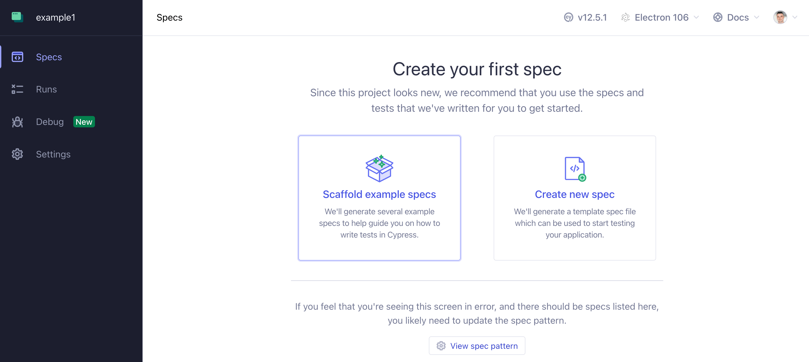
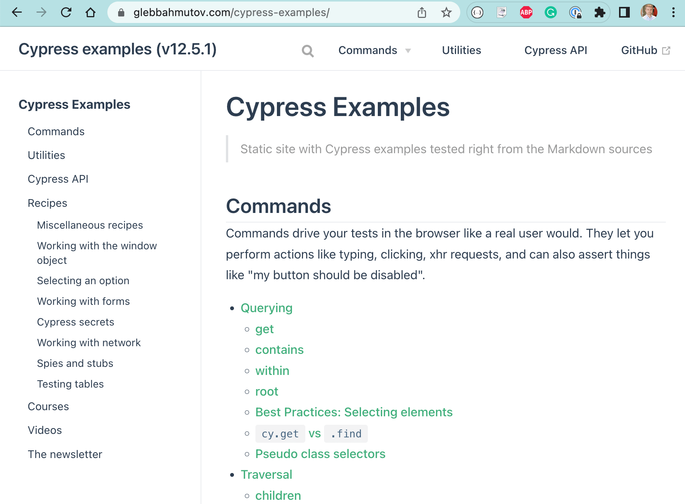
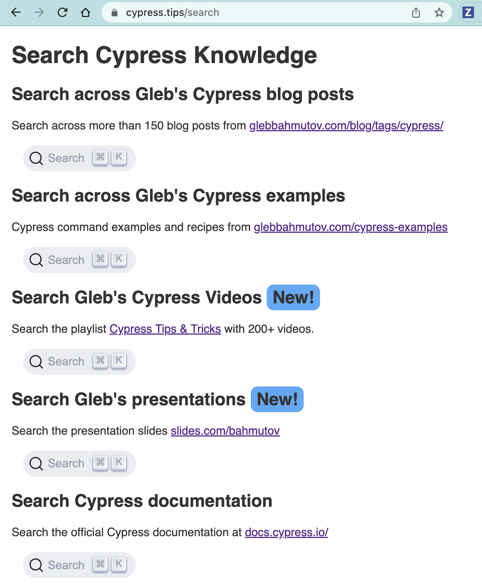

## ☀️ Starting new projects

### 📚 You will learn

- Cypress folder structure
- Writing the first test
- Setting up intelligent code completion
- Cypress documentation

---

## Quick check: Node.js

```bash
$ node -v
v14.17.1
$ npm -v
6.14.13
# optional:
$ yarn -v
1.22.10
```

If you need to install Node, see [Basics Requirements](https://github.com/bahmutov/cypress-workshop-basics#requirements) and 📹 [Install Node and Cypress](https://www.youtube.com/watch?v=09KbTRLrgWA)

---

## Todo: make a new project and add Cypress

Create a new folder

- `cd /tmp`
- `mkdir example`
- `cd example`
- `npm init --yes`
- `npm install -D cypress`

+++

### Cypress bin

When you run `npm install cypress` it creates a "cypress" alias in the `node_modules/.bin" folder. You can see all tools that install aliases (depending on the platform)

```text
$ ls node_modules/.bin
cypress			nanoid			rollup			sshpk-verify		vite
esbuild			prettier		server-test		start-server-and-test	wait-on
extract-zip		ps-tree			sshpk-conv		start-test
is-ci			rimraf			sshpk-sign		uuid
```

Let's run Cypress alias

+++

### How to open Cypress

```shell
npx cypress open
# or
yarn cypress open
# or
$(npm bin)/cypress open
# or
./node_modules/.bin/cypress open
```

+++

## 💡 Pro tip

In `package.json` I usually have

```json
{
  "scripts": {
    "cy:open": "cypress open",
    "cy:run": "cypress run"
  }
}
```

And I use `npm run cy:open`

**Tip:** read [https://glebbahmutov.com/blog/organize-npm-scripts/](https://glebbahmutov.com/blog/organize-npm-scripts/)

---


+++


+++



+++


---

## Cypress files and folders

- "cypress.config.js" - all Cypress settings
- "cypress/e2e" - end-to-end test files (specs)
- "cypress/fixtures" - mock data <!-- .element: class="fragment" -->
- "cypress/support" - shared commands, utilities <!-- .element: class="fragment" -->

Read blog post [Cypress is just ...](https://glebbahmutov.com/blog/cypress-is/)

Note:
This section shows how Cypress scaffolds its files and folders. Then the students can ignore this folder. This is only done once to show the scaffolding.

---

Look at the scaffolded example test files (specs).

Run specs for topics that look interesting

---

## 💡 Pro tip

```shell
# quickly scaffolds Cypress folders
$ npx @bahmutov/cly init
# bare scaffold
$ npx @bahmutov/cly init -b
# typescript scaffold
$ npx @bahmutov/cly init --typescript
```

Repo [github.com/bahmutov/cly](https://github.com/bahmutov/cly)

---

## [glebbahmutov.com/cypress-examples](https://glebbahmutov.com/cypress-examples/)



---

## First spec

Let's test our TodoMVC application. Create a new spec file

- `cypress/e2e/spec.cy.js`

**tip:** the default spec pattern is `cypress/e2e/**/*.cy.{js,jsx,ts,tsx}`

+++

Type into the `spec.cy.js` our first test

```javascript
it('loads', () => {
  cy.visit('localhost:3000')
})
```

+++

- make sure you have started TodoMVC in another terminal with `npm start`
- click on "spec.cy.js" in Cypress GUI

+++

## Questions

- what does Cypress do?
- what happens when the server is down?
  - stop the application server running in folder `todomvc`
  - reload the tests

---


---

Add a special `/// ...` comment

```javascript
/// <reference types="cypress" />
it('loads', () => {
  cy.visit('localhost:3000')
})
```

- why do we need `reference types ...` line?

Note:
By having "reference" line we tell editors that support it (VSCode, WebStorm) to use TypeScript definitions included in Cypress to provide intelligent code completion. Hovering over any `cy` command brings helpful tooltips.

+++

## IntelliSense


+++

Every Cypress command and every assertion


+++

Using `ts-check`

```javascript
/// <reference types="cypress" />
// @ts-check
it('loads', () => {
  cy.visit('localhost:3000')
})
```

- what happens if you add `ts-check` line and misspell `cy.visit`?

Note:
The check works really well in VSCode editor. I am not sure how well other editors support Cypress type checks right out of the box.

---

## Docs

Your best friend is [https://docs.cypress.io/](https://docs.cypress.io/) search


+++

## TODO: Find at docs.cypress.io

- Cypress main features and how it works docs <!-- .element: class="fragment" -->
- core concepts <!-- .element: class="fragment" -->
- command API <!-- .element: class="fragment" -->
  - how many commands are there?
- frequently asked questions <!-- .element: class="fragment" -->

+++

## 💡 Pro tip

```text
https://on.cypress.io/<command>
```

The above URL goes right to the documentation for that command.

+++

## Todo: find at docs.cypress.io

- documentation for `click`, `type`, and `contains` commands
- assertions examples <!-- .element: class="fragment" -->

---

## Todo: Find at docs.cypress.io

- examples
  - recipes
  - tutorial videos
  - example applications
  - blogs
  - FAQ
- Cypress changelog and roadmap

Note:
Students should know where to find information later on. Main resources is the api page [https://on.cypress.io/api](https://on.cypress.io/api)

---

## 🏆 [cypress.tips/search](https://cypress.tips/search)



---

## 🏁 Conclusions

- use IntelliSense
- use Docs are [https://docs.cypress.io/](https://docs.cypress.io/)

➡️ Pick the [next section](https://github.com/bahmutov/cypress-workshop-basics#contents)
