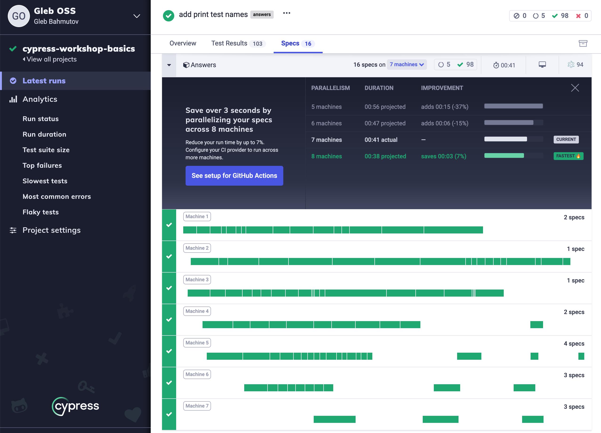
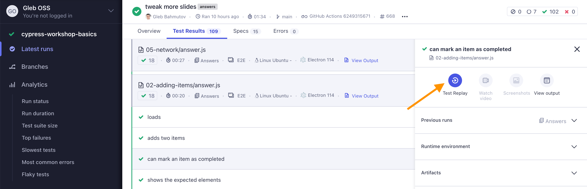
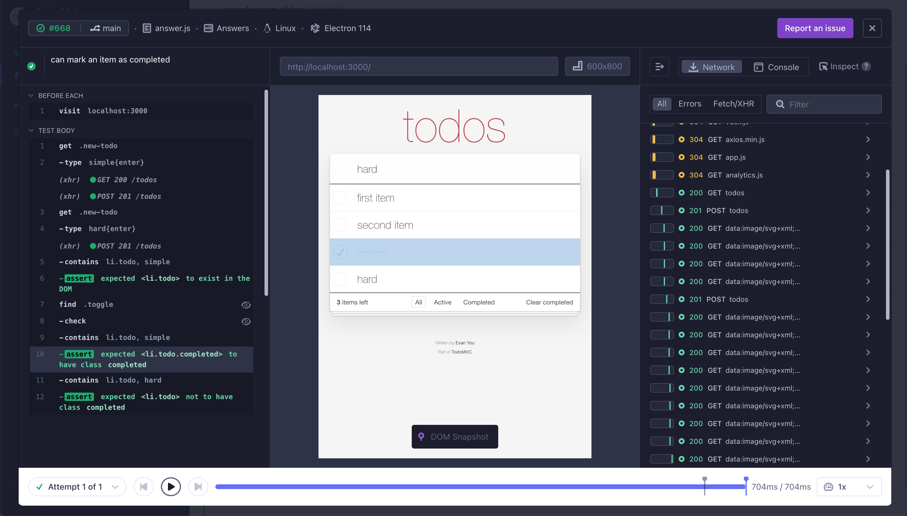

## ☀️ Part 7: Continuous integration

### 📚 You will learn

- Cypress Docker images for dependencies
- Installing and caching Cypress itself
- How to start server and run Cypress tests
- CircleCI Orb example
- GitHub Actions example
- GitHub reusable workflows
- How to run tests faster
- Cypress paid Test Replay

---

## Poll: what CI do you use?

- ❤️ GitHub Actions
- 👏 CircleCI
- 👍 Jenkins
- 🎉 Something else

---

## Todo if possible

- sign up for free account on CircleCI
- use your fork of https://github.com/bahmutov/testing-app-example

Or make your copy of it using

```
$ npx degit https://github.com/bahmutov/testing-app-example test-app-my-example
$ cd test-app-my-example
$ npm i
$ npm start
# create GitHub repo and push "test-app-my-example"
```

---

## Open vs Run

- run the specs in the interactive mode with `cypress open`
- run the specs in the headless mode with `cypress run`

See [https://on.cypress.io/command-line](https://on.cypress.io/command-line)

+++

## Set up Cypress

```
$ npm i -D cypress
$ npx @bahmutov/cly init -b
# add a test or two
```

---

## Set up CircleCI

- sign up for CircleCI
- add your project to CircleCI


+++

## Continuous integration documentation

- [https://on.cypress.io/continuous-integration](https://on.cypress.io/continuous-integration)
- [https://on.cypress.io/ci](https://on.cypress.io/ci) (alias)

---

## On every CI:

- install and cache dependencies
- start `todomvc` server in the background
- run Cypress using `npx cypress run`
- (maybe) stop the `todomvc` server

+++

```yaml
version: 2
jobs:
  build:
    docker:
      - image: cypress/base:16.14.2-slim
    working_directory: ~/repo
    steps:
      - checkout
      - restore_cache:
          keys:
            - dependencies-{{ checksum "package.json" }}
            # fallback to using the latest cache if no exact match is found
            - dependencies-
      - run:
          name: Install dependencies
          # https://docs.npmjs.com/cli/ci
          command: npm ci
      - save_cache:
          paths:
            - ~/.npm
            - ~/.cache
          key: dependencies-{{ checksum "package.json" }}
      # continued: start the app and run the tests
```

+++

```yaml
# two commands: start server, run tests
- run:
    name: Start TodoMVC server
    command: npm start
    working_directory: todomvc
    background: true
- run:
    name: Run Cypress tests
    command: npx cypress run
```

+++

Alternative: use [start-server-and-test](https://github.com/bahmutov/start-server-and-test)

```yaml
- run:
  name: Start and test
  command: npm run ci
```

```json
{
  "scripts": {
    "start": "npm start --prefix todomvc -- --quiet",
    "test": "cypress run",
    "ci": "start-test http://localhost:3000"
  }
}
```

---

## CircleCI Cypress Orb

A _much simpler_ CI configuration. **⚠️ Warning:** Cypress Orb v3 has significant changes.

```yaml
version: 2.1
orbs:
  # import Cypress orb by specifying an exact version x.y.z
  # or the latest version 2.x.x using "@1" syntax
  # https://github.com/cypress-io/circleci-orb
  cypress: cypress-io/cypress@2
workflows:
  build:
    jobs:
      # "cypress" is the name of the imported orb
      # "run" is the name of the job defined in Cypress orb
      - cypress/run:
          start: npm start
```

See [https://github.com/cypress-io/circleci-orb](https://github.com/cypress-io/circleci-orb)

+++

## Todo

Look how tests are run in [.circleci/config.yml](https://github.com/bahmutov/cypress-workshop-basics/blob/main/.circleci/config.yml) using [cypress-io/circleci-orb](https://github.com/cypress-io/circleci-orb).

---

## Store test artifacts

```yaml
version: 2.1
orbs:
  # https://github.com/cypress-io/circleci-orb
  cypress: cypress-io/cypress@2
workflows:
  build:
    jobs:
      - cypress/run:
          # store videos and any screenshots after tests
          store_artifacts: true
```

+++

## Record results on Dashboard

```yaml
version: 2.1
orbs:
  # https://github.com/cypress-io/circleci-orb
  cypress: cypress-io/cypress@2
workflows:
  build:
    jobs:
      # set CYPRESS_RECORD_KEY as CircleCI
      # environment variable
      - cypress/run:
          record: true
```

[https://on.cypress.io/dashboard-introduction](https://on.cypress.io/dashboard-introduction)

+++

## Parallel builds

```yaml
version: 2.1
orbs:
  # https://github.com/cypress-io/circleci-orb
  cypress: cypress-io/cypress@2
workflows:
  build:
    jobs:
      - cypress/install # single install job
      - cypress/run: # 4 test jobs
          requires:
            - cypress/install
          record: true # record results on Cypress Dashboard
          parallel: true # split all specs across machines
          parallelism: 4 # use 4 CircleCI machines
```

+++

## CircleCI Cypress Orb

Never struggle with CI config 👍

- [github.com/cypress-io/circleci-orb](https://github.com/cypress-io/circleci-orb)
- [circleci.com/orbs/registry/orb/cypress-io/cypress](https://circleci.com/orbs/registry/orb/cypress-io/cypress)
- 📺 [CircleCI + Cypress webinar](https://youtu.be/J-xbNtKgXfY)

---

## GitHub Actions

- cross-platform CI built on top of Azure CI + MacStadium
- Linux, Windows, and Mac
- Official [cypress-io/github-action](https://github.com/cypress-io/github-action)

+++

```yaml
jobs:
  cypress-run:
    runs-on: ubuntu-20.04
    steps:
      - uses: actions/checkout@v4
      # https://github.com/cypress-io/github-action
      - uses: cypress-io/github-action@v6
        with:
          start: npm start
          wait-on: 'http://localhost:3000'
```

Check [.github/workflows/ci.yml](https://github.com/bahmutov/cypress-workshop-basics/blob/main/.github/workflows/ci.yml)

---

## GitHub Reusable Workflows

```yml
name: ci
on: [push]
jobs:
  test:
    # use the reusable workflow to check out the code, install dependencies
    # and run the Cypress tests
    # https://github.com/bahmutov/cypress-workflows
    uses: bahmutov/cypress-workflows/.github/workflows/standard.yml@v1
    with:
      start: npm start
```

[https://github.com/bahmutov/cypress-workflows](https://github.com/bahmutov/cypress-workflows)

---

## Cypress on CI: the take away

- use `npm ci` command instead of `npm install`
- cache `~/.npm` and `~/.cache` folders
- use [start-server-and-test](https://github.com/bahmutov/start-server-and-test) for simplicity
- store videos and screenshots yourself or use Cypress Dashboard

---

## Run E2E faster

1. Run changed specs first
2. Run tests by tag
3. Run tests in parallel
4. Run specs based on test IDs in the modified source files

+++

1. Run changed specs first

📝 Read [Get Faster Feedback From Your Cypress Tests Running On CircleCI](https://glebbahmutov.com/blog/faster-ci-feedback-on-circleci/)

```
$ specs=$(npx find-cypress-specs --branch main)
$ npx cypress run --spec $specs
```

See [find-cypress-specs](https://github.com/bahmutov/find-cypress-specs)

+++

2. Run tests by tag

📝 Read [How To Tag And Run End-to-End Tests](https://glebbahmutov.com/blog/tag-tests/)

```js
it('logs in', { tags: 'user' }, () => ...)
```

```
$ npx cypress run --env grepTags=user
```

See [@bahmutov/cy-grep](https://github.com/bahmutov/cy-grep)

+++

3. Run tests in parallel



+++

4. Run specs based on test IDs in the modified source files

📝 Read [Using Test Ids To Pick Cypress Specs To Run](https://glebbahmutov.com/blog/using-test-ids-to-pick-specs-to-run/)

+++

## Examples of running specs in parallel

- 📝 [Make Cypress Run Faster by Splitting Specs](https://glebbahmutov.com/blog/split-spec/)
- 📝 [Split Long GitHub Action Workflow Into Parallel Cypress Jobs](https://glebbahmutov.com/blog/parallel-cypress-tests-gh-action/)
- 📝 [Testing Time Zones in Parallel](https://glebbahmutov.com/blog/testing-timezones/)

---

## Run tests in parallel for free

- 🔌 plugin [cypress-split](https://github.com/bahmutov/cypress-split)
- 📝 read https://glebbahmutov.com/blog/cypress-parallel-free/

---

## Test Replay

- optional paid Cypress service for recording tests
- requires Cypress v13+
- recreates the local time travel experience

+++


Click on the Cypress Cloud badge to view recorded tests

+++

Test replays for each test run at https://cloud.cypress.io/projects/89mmxs/runs

Good example test is "can mark an item as completed" from `02-adding-items/answer.js`

+++



+++



## Todo

Find the CI you use on [https://on.cypress.io/continuous-integration](https://on.cypress.io/continuous-integration) and [https://github.com/cypress-io/cypress-example-kitchensink#ci-status](https://github.com/cypress-io/cypress-example-kitchensink#ci-status)

---

## 🏁 Cypress on CI

- presentation [CircleCI Orbs vs GitHub Actions vs Netlify Build Plugins CI Setup](https://slides.com/bahmutov/ci-triple)
- my [GitHub Actions blog posts](https://glebbahmutov.com/blog/tags/github/)
- my [CircleCI blog posts](https://glebbahmutov.com/blog/tags/circle/)

➡️ Pick the [next section](https://github.com/bahmutov/cypress-workshop-basics#contents) or jump to the [08-retry-ability](?p=08-retry-ability) chapter
