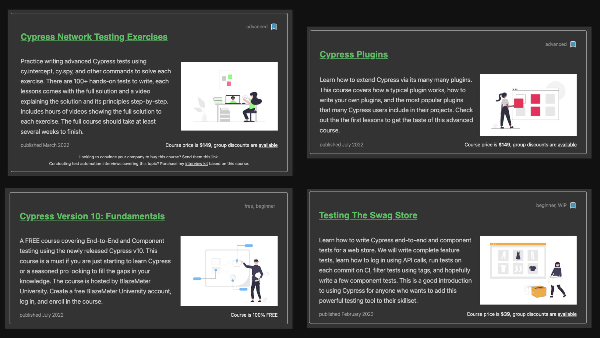

# Cypress Workshop: Basics

- [github.com/bahmutov/cypress-workshop-basics](https://github.com/bahmutov/cypress-workshop-basics)

Jump to: [00-start](?p=00-start), [01-basic](?p=01-basic), [02-adding-items](?p=02-adding-items), [03-selector-playground](?p=03-selector-playground), [04-reset-state](?p=04-reset-state), [05-xhr](?p=05-xhr), [06-app-data-store](?p=06-app-data-store), [07-ci](?p=07-ci), [08-retry-ability](?p=08-retry-ability), [09-custom-commands](?p=09-custom-commands), [10-component-testing](?p=10-component-testing), [end](?p=end)

+++

## Author: Gleb Bahmutov, PhD

- Ex-VP of Engineering at Cypress
- Ex-Distinguished Engineer at Cypress
- actively using Cypress since 2016
- [gleb.dev](https://gleb.dev)
- [@bahmutov](https://twitter.com/bahmutov)
- [https://glebbahmutov.com/blog/tags/cypress/](https://glebbahmutov.com/blog/tags/cypress/) 300+ Cypress blog posts
- [https://www.youtube.com/glebbahmutov](https://www.youtube.com/glebbahmutov) 500+ Cypress videos
- [cypress.tips](https://cypress.tips) with links, search, my courses
- [Cypress Tips](https://cypresstips.substack.com/) monthly newsletter

+++

[cypress.tips/courses](https://cypress.tips/courses)



---

## What we are going to cover 1/2

- example TodoMVC
  - web app, data store, REST calls
- basic page load test
- selector playground
- resetting state before the test
- any questions

+++

## What we are going to cover 2/2

- network spying and stubbing, fixtures
- running E2E tests on CI / Test Replay
- retry-ability and flake-free tests
- custom commands
- component testing
- any questions

---

## Schedule 🕰

- Unit 1: 08.30am - 10.00am ☕️
- Unit 2: 10.30am - 12.00pm
- Lunch Break: 12.00pm to 1.00pm
- Unit 3: 1.00pm - 2.30pm ☕️
- Unit 4: 3.00pm - 4.30pm
- time for questions during the workshop and after each section

+++

<!-- Please: if you have experience with Cypress.io, help others during the workshop 🙏 -->

## Poll 1 🗳️: have you used Cypress before?

- This is my first time
- Using for less than 1 month 👍<!-- .element: class="fragment" -->
- Using it for less than 1 year 👍👍<!-- .element: class="fragment" -->
- Using for longer than 1 year ❤️<!-- .element: class="fragment" -->
- Using for longer than 2 years ❤️❤️<!-- .element: class="fragment" -->

---

## Poll 2 🗳️: have you used other E2E test runners?

- Selenium / Webdriver
- Protractor <!-- .element: class="fragment" -->
- TestCafe <!-- .element: class="fragment" -->
- Puppeteer / Playwright <!-- .element: class="fragment" -->
- Something else? <!-- .element: class="fragment" -->

---

## Poll 3 🗳️: what unit testing tool do you use?

- Jest
- Mocha <!-- .element: class="fragment" -->
- Ava <!-- .element: class="fragment" -->
- Tap/Tape <!-- .element: class="fragment" -->
- `node:test` <!-- .element: class="fragment" -->
- Something else? <!-- .element: class="fragment" -->

---

## Last poll 🗳️: Do you use TypeScript

- no
- a little <!-- .element: class="fragment" -->
- half of the time <!-- .element: class="fragment" -->
- all the time <!-- .element: class="fragment" -->

---

## How efficient learning works

1. I explain and show
2. We do together
3. You do and I help

**Tip:** this repository has everything to work through the test exercises.

[bahmutov/cypress-workshop-basics](https://github.com/bahmutov/cypress-workshop-basics)

+++

🎉 If you can make all "cypress/e2e/.../spec.js" tests work, you know Cypress.

Tip 💡: there are about 90+ tests to fill with code, see them with "npm run names" command by using "find-cypress-specs" <!-- .element: class="fragment" -->

---

## Requirements

You will need:

- `git` to clone this repo
- Node v16+ to install dependencies

```text
git clone <repo url>
cd cypress-workshop-basics
npm install
```

---

## Repo organization

- `/todomvc` is a web application we are going to test
- all tests are in `cypress/e2e` folder
  - there are subfolders for exercises
    - `01-basic`
    - `02-adding-items`
    - `03-selector-playground`
    - `04-reset-state`
    - etc
- keep application `todomvc` running!

Note:
We are going to keep the app running, while switching from spec to spec for each part.

+++

## `todomvc`

Let us look at the application.

- `cd todomvc`
- `npm start`
- `open localhost:3000`

**important:** keep application running through the entire workshop!

+++

It is a regular TodoMVC application.


+++

If you have Vue DevTools plugin


+++

Look at XHR when using the app


+++

Look at `todomvc/index.html` - main app DOM structure


+++

Look at `todomvc/app.js`


+++

## Questions

- what happens when you add a new Todo item? <!-- .element: class="fragment" -->
- how does it get to the server? <!-- .element: class="fragment" -->
- where does the server save it? <!-- .element: class="fragment" -->
- what happens on start up? <!-- .element: class="fragment" -->

Note:
The students should open DevTools and look at XHR requests that go between the web application and the server. Also the students should find `todomvc/data.json` file with saved items.

---


Note:
This app has been coded and described in this blog post [https://www.cypress.io/blog/2017/11/28/testing-vue-web-application-with-vuex-data-store-and-rest-backend/](https://www.cypress.io/blog/2017/11/28/testing-vue-web-application-with-vuex-data-store-and-rest-backend/)

+++

This app has been coded and described in this blog post [https://www.cypress.io/blog/2017/11/28/testing-vue-web-application-with-vuex-data-store-and-rest-backend/](https://www.cypress.io/blog/2017/11/28/testing-vue-web-application-with-vuex-data-store-and-rest-backend/)

---

## End of introduction

➡️ Pick the [next section](https://github.com/bahmutov/cypress-workshop-basics#contents) or go to the [00-start](?p=00-start) chapter
